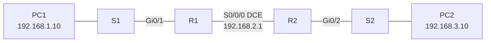

# Lab W8 — Basic Router Configuration (Cisco IOS CLI)

## Overview

First full Cisco IOS CLI lab: cabling a two-router network with a serial WAN link, performing the standard initial configuration on both routers (hostname, passwords, banner, line security), addressing all interfaces, and verifying with `show` commands. The lab deliberately ends with hosts on opposite LANs *unable* to reach each other — demonstrating why routing (covered in Lab W9) is required beyond directly connected networks.

## Objectives

* Cable and configure a basic two-router network with a serial DCE/DTE link
* Perform initial router configurations (hostname, secure access, banner)
* Apply the provided IPv4 addressing scheme to router interfaces and hosts
* Verify routing table entries and interface status; test connectivity
* Troubleshoot common configuration errors systematically

## Technologies & Tools

* Cisco Packet Tracer
* Cisco IOS CLI
* Cisco 2911 routers (×2), 2950T switches (×2), 2 PCs
* Serial (DCE/DTE) WAN link, Gigabit Ethernet LANs, Telnet

## Network Topology



LAN1 = `192.168.1.0/24`, WAN link R1–R2 = `192.168.2.0/30`, LAN2 = `192.168.3.0/24`.

## IP Addressing

| Device | Interface | IP Address | Subnet Mask | Gateway |
| ------ | --------- | ---------- | ----------- | ------- |
| R1 | Gi0/1 | 192.168.1.1 | 255.255.255.0 | N/A |
| R1 | S0/0/0 (DCE) | 192.168.2.1 | 255.255.255.252 | N/A |
| R2 | Gi0/2 | 192.168.3.1 | 255.255.255.0 | N/A |
| R2 | S0/0/0 | 192.168.2.2 | 255.255.255.252 | N/A |
| PC1 | NIC | 192.168.1.10 | 255.255.255.0 | 192.168.1.1 |
| PC2 | NIC | 192.168.3.10 | 255.255.255.0 | 192.168.3.1 |

## Network Configuration

Initial configuration on R1 (repeated on R2 with hostname `R2`):

```text
Router>enable
Router#configure terminal
Router(config)#hostname R1
R1(config)#no ip domain-lookup
R1(config)#enable secret [REDACTED]
R1(config)#banner motd &
  !!!AUTHORIZED ACCESS ONLY!!!
&
R1(config)#line console 0
R1(config-line)#password [REDACTED]
R1(config-line)#login
R1(config-line)#exit
R1(config)#line vty 0 4
R1(config-line)#password [REDACTED]
R1(config-line)#login
R1(config-line)#exit
```

Interface configuration:

```text
R1(config)#interface GigabitEthernet0/1
R1(config-if)#ip address 192.168.1.1 255.255.255.0
R1(config-if)#no shutdown

R1(config-if)#interface serial 0/0/0
R1(config-if)#ip address 192.168.2.1 255.255.255.252
R1(config-if)#clock rate 64000        ! DCE side only
R1(config-if)#no shutdown

R1#copy running-config startup-config
```

Key points: `no ip domain-lookup` prevents the router hanging on mistyped commands; `clock rate` is set on the DCE end of the serial link; the serial link only comes up once both ends are configured; the config is saved to NVRAM.

*(Passwords used are the values defined by the lab worksheet; redacted here as a documentation practice.)*

## Verification & Testing

```text
show running-config
show ip route             ! expect two "C" (connected) routes per router
show ip interface brief   ! configured interfaces up/up
ping 192.168.1.1          ! PC1 → default gateway
ping 192.168.3.1          ! PC2 → default gateway
ping 192.168.2.2          ! R1 → R2 across the serial link
telnet 192.168.1.1        ! remote management via VTY line
```

A systematic troubleshooting checklist was applied when tests failed: physical connections/link lights → host configuration vs. topology diagram → interface status via `show ip interface brief` → `clock rate` on the DCE side.

## Results

* Both routers fully configured and reachable from their local LANs; R1 ↔ R2 ping successful over serial
* Routing tables showed only directly connected (`C`) networks
* **Reflection (expected failures):** PC1 ↔ PC2 and host-to-remote-router pings fail because R1 has no route to LAN2 and R2 has no route to LAN1 — motivating static routing in Lab W9

## Exercise Extension

A second scenario required designing the addressing (rather than being given it): subnet the allocated `202.184.5.128/25` block with VLSM for LAN-A (20 hosts), LAN-B (20 hosts + server), and the R1–R2 WAN link; assign first/last valid hosts per the placement rules; then repeat the full build, configuration, and verification. *(The worksheet also mentions `192.168.1.128/25` in one paragraph — an apparent inconsistency in the source; the topology diagram specifies `202.184.5.128/25`.)*

## Key Learning Outcomes

* Standard Cisco IOS initial-configuration sequence and device hardening basics (enable secret, console/VTY passwords, MOTD banner)
* Reading routing tables and interface status output
* DCE/DTE serial link behavior and why connectivity requires routes, not just links

## Skills Demonstrated

* Cisco IOS CLI configuration
* Router and switch deployment
* IPv4 interface addressing
* Network verification (`show ip route`, `show ip interface brief`)
* Structured troubleshooting
* Remote management via Telnet

## Portfolio Relevance

This is the canonical entry-level network engineering task — bringing up routers from a blank config, securing access, and proving connectivity with IOS show commands. Directly relevant to NOC, network engineering, and infrastructure internships.
